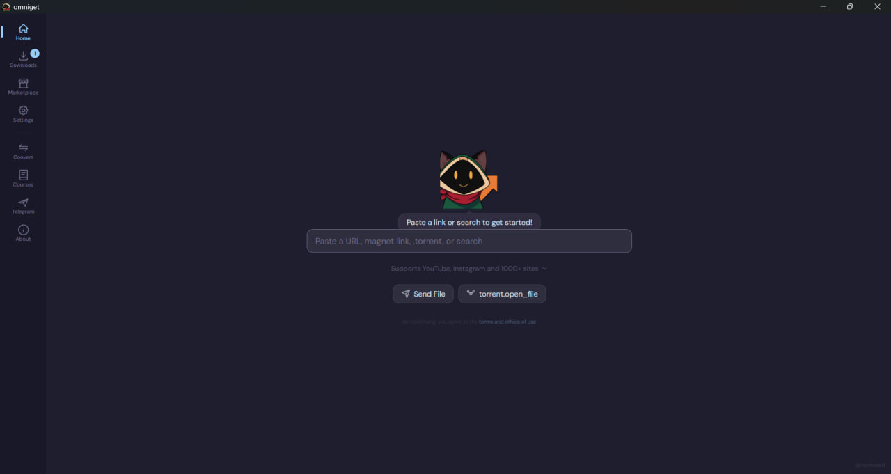

<p align="center">
  
</p>

<p align="center">
  <a href="https://github.com/tonhowtf/omniget/releases/latest"></a>
  <a href="LICENSE"></a>
  <a href="https://github.com/tonhowtf/omniget/stargazers"></a>
</p>

<h1 align="center">OmniGet</h1>

<h3 align="center">Paste a link. Get your file.<br>No browser extensions, no web apps</h3>

OmniGet is a free, open source desktop app for downloading videos and media from the internet. It natively supports YouTube, Instagram, TikTok, Twitter/X, Reddit, Twitch, Pinterest, Vimeo, Bluesky, Hotmart courses, Udemy courses, and Telegram. Any other URL falls back to yt-dlp, covering [1000+ additional sites](https://github.com/yt-dlp/yt-dlp/blob/master/supportedsites.md).

Built with Tauri and Rust for speed and a small footprint.

<p align="center">
  
</p>

## Features

- Download from 12 platforms natively, plus [1000+ more via yt-dlp](https://github.com/yt-dlp/yt-dlp/blob/master/supportedsites.md)
- Download full Hotmart and Udemy courses with login (videos, attachments, descriptions)
- Download Telegram media with QR code or phone number login
- Convert media files between formats with FFmpeg and GPU acceleration
- Search YouTube directly from the omnibox
- Choose quality, format, and download mode (video, audio only, mute)
- Real-time progress with speed display
- Global hotkey to download from clipboard URL
- Clipboard URL detection and batch downloads
- System tray with download count badge
- Built-in auto-updater
- Proxy support (HTTP/SOCKS5)
- Dark and light theme
- Available in English, Portuguese, Chinese, Japanese, Italian, and French
- Loop, the mascot that reacts to your downloads

## Supported Platforms

| Platform | Content |
|----------|---------|
| YouTube | Videos, Shorts, Playlists, Search |
| Instagram | Posts, Reels, Stories |
| TikTok | Videos, Photos |
| Twitter / X | Videos, GIFs |
| Reddit | Videos, Images |
| Twitch | Clips |
| Pinterest | Images, Videos |
| Vimeo | Videos (with referer support) |
| Bluesky | Images, Videos |
| Hotmart | Full courses with login |
| Udemy | Full courses with login |
| Telegram | Photos, Videos, Files, Audio |
| [1000+ more](https://github.com/yt-dlp/yt-dlp/blob/master/supportedsites.md) | Anything yt-dlp supports |

Platform availability may vary depending on each service.

## Download

Grab the latest release for your platform:

<p align="center">
  <a href="https://github.com/tonhowtf/omniget/releases/latest"></a>
  <a href="https://github.com/tonhowtf/omniget/releases/latest"></a>
  <a href="https://github.com/tonhowtf/omniget/releases/latest"></a>
</p>

Linux is also available as a Flatpak. If you run into issues on any platform, please [open an issue](https://github.com/tonhowtf/omniget/issues).

## Windows SmartScreen

Windows SmartScreen may warn you the first time you run OmniGet. This is normal for open source apps without a paid code signing certificate. Click **More info**, then **Run anyway**.

The app is fully open source and every line of code is right here in this repository.

## macOS Gatekeeper

macOS may block OmniGet because the app is not yet signed with an Apple Developer certificate. If you see "omniget.app is damaged" or "can't be opened", run this in Terminal:

```bash
xattr -cr /Applications/omniget.app
codesign --force --deep --sign - /Applications/omniget.app
```

## Building From Source

Prerequisites: [Rust](https://rustup.rs/), [Node.js](https://nodejs.org/) 18+, [pnpm](https://pnpm.io/)

On Linux, install additional dependencies:

```bash
sudo apt-get install -y libwebkit2gtk-4.1-dev libappindicator3-dev librsvg2-dev patchelf
```

Then build and run:

```bash
git clone https://github.com/tonhowtf/omniget.git
cd omniget
pnpm install
pnpm tauri dev
```

For a production build:

```bash
pnpm tauri build
```

## Legal

OmniGet facilitates downloading publicly available content from the internet. You are responsible for how you use it. Personal use is supported by Article 184, §4 of the Brazilian Penal Code, which allows copying works for private use without profit intent.

Respect copyright and each platform's terms of service.

## Contributing

Found a bug or want to suggest a feature? [Open an issue](https://github.com/tonhowtf/omniget/issues). Pull requests are welcome.

## License

OmniGet is licensed under [GPL-3.0](LICENSE). The OmniGet name, logo, and Loop mascot are project trademarks not covered by the code license.

<!-- omniget, video downloader, media downloader, youtube downloader, instagram downloader, tiktok downloader, twitter downloader, reddit downloader, twitch downloader, pinterest downloader, vimeo downloader, bluesky downloader, hotmart downloader, udemy downloader, telegram downloader, course downloader, desktop app, open source, rust, tauri -->
