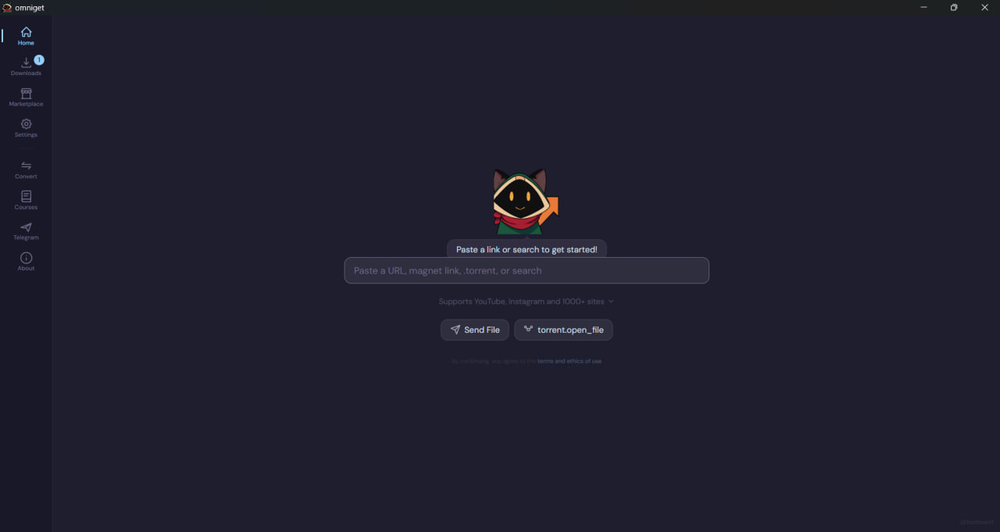

<p align="center">
  
</p>

<p align="center">
  <a href="https://github.com/tonhowtf/omniget/releases/latest"></a>
  <a href="LICENSE"></a>
  <a href="https://github.com/tonhowtf/omniget/stargazers"></a>
</p>

<h1 align="center">OmniGet</h1>

<h3 align="center">Paste a link. Get your file.</h3>

OmniGet is a free, open-source desktop app that downloads videos, courses, and media from the internet. It handles YouTube, Instagram, TikTok, and dozens more platforms out of the box — plus torrents, P2P file transfers, and [1000+ sites via yt-dlp](https://github.com/yt-dlp/yt-dlp/blob/master/supportedsites.md). Built with Rust and Tauri for speed and a small footprint.

<p align="center">
  
</p>

## Download

<p align="center">
  <a href="https://github.com/tonhowtf/omniget/releases/latest"></a>
  <a href="https://github.com/tonhowtf/omniget/releases/latest"></a>
  <a href="https://github.com/tonhowtf/omniget/releases/latest"></a>
</p>

Also available as a Flatpak on Linux and a portable `.exe` on Windows.

## Features

- 📥 Downloads from YouTube, Instagram, TikTok, Twitter/X, Reddit, and [10+ more platforms](#media-platforms) with native downloaders
- 🎓 Downloads full courses from [36 education platforms](#course-platforms) — log in once, download all lessons
- 🧲 Built-in torrent client for magnet links and `.torrent` files (drag-and-drop supported)
- 📡 P2P file transfer between devices via relay — no port forwarding needed
- 🔍 Search YouTube directly from the omnibox
- 🧩 Plugin marketplace for courses, Telegram, format conversion, and more
- 🌐 Chrome extension detects videos on pages and sends them to the app
- ⚡ Auto-manages yt-dlp and FFmpeg — no manual setup required
- 🎨 Dark, light, and system themes in 8 languages
- 🔄 Built-in auto-updater on all platforms

## Supported Platforms

### Media Platforms

| Platform | Content |
|----------|---------|
| YouTube | Videos, Shorts, Playlists, Search |
| Instagram | Posts, Reels, Stories |
| TikTok | Videos, Photos |
| Twitter / X | Videos, GIFs |
| Reddit | Videos, Images |
| Twitch | Clips |
| Pinterest | Images, Videos |
| Vimeo | Videos |
| Bluesky | Images, Videos |
| Bilibili (哔哩哔哩) | Videos, Series |
| Telegram | Photos, Videos, Files (via plugin) |
| Torrent / Magnet | Any `.torrent` file or magnet link |

<details>
<summary><strong>Chinese platforms</strong> (supported via yt-dlp with URL detection)</summary>

| Platform | Content |
|----------|---------|
| Douyin (抖音) | Videos |
| Xiaohongshu (小红书) | Videos, Images |
| Kuaishou (快手) | Videos |
| Youku (优酷) | Videos |
| Tencent Video (腾讯视频) | Videos |
| iQiyi (爱奇艺) | Videos |
| Mango TV (芒果TV) | Videos |

These platforms may require a Chinese IP address.

</details>

Any other URL falls back to [yt-dlp](https://github.com/yt-dlp/yt-dlp), covering **1000+ additional sites**.

### Course Platforms

Downloads full courses (videos, attachments, descriptions) from 36 education platforms via the courses plugin. Top platforms include Hotmart, Udemy, Kiwify, Teachable, Kajabi, Skool, Pluralsight, MasterClass, and Rocketseat.

<details>
<summary><strong>View all 36 course platforms</strong></summary>

| Platform | Auth | Region |
|----------|------|--------|
| Hotmart | Email + Password | BR / Global |
| Udemy | Email + Cookies | Global |
| Kiwify | Email + Password / Token | BR |
| Gumroad | Email + Password / Token | Global |
| Teachable | OTP (Email) | Global |
| Kajabi | OTP (Email) | Global |
| Skool | Email + Password | Global |
| Pluralsight | Browser Cookies | Global |
| MasterClass | Browser Cookies | Global |
| Wondrium / Great Courses | Email + Password / Token | US |
| Thinkific | Browser Cookies | Global |
| Rocketseat | Browser Cookies | BR |
| Estratégia Concursos | Token / Cookies | BR |
| Estratégia LDI | Token / Cookies | BR |
| Estratégia Militares | Token / Cookies | BR |
| Gran Cursos Online | Session Cookies | BR |
| Fluency Academy | Email + Password / Token | BR |
| Data Science Academy | Token | BR |
| Eduzz / Nutror | Token | BR |
| Kirvano | Token | BR |
| MemberKit | Email + Password / Cookies | BR |
| Cademi | Email + Password / Cookies | BR |
| Curseduca | Email + Password / Token | BR |
| Medcel | Token + API Key | BR |
| Medcof | Token | BR |
| Medway | Token | BR |
| Afya Internato | Token + API Key | BR |
| AlpaClass | Token | BR |
| Área de Membros | Cookies | BR |
| Astron Members | Email + Password / Cookies | BR |
| Cakto | Email + Password / Cookies | BR |
| Cakto Members | Cookies | BR |
| Greenn Club | Token | BR |
| TheMembers | Email + Password / Token | BR |
| Voomp Play | Token | BR |
| Entrega Digital | Token + Metadata | BR |

</details>

## How It Works

1. **Paste a URL** (or drag a `.torrent`, or search YouTube) into the omnibox
2. OmniGet detects the platform and shows a preview with quality options
3. Click download — progress, speed, and ETA update in real time

For courses: log in to the platform, browse your library, and batch-download entire courses with one click.

## Browser Extension

The Chrome extension detects supported pages and sends them to OmniGet with one click.

1. Install OmniGet and launch it once (registers the native messaging host)
2. Load the extension from `browser-extension/chrome/` in `chrome://extensions` (developer mode)
3. Click the OmniGet icon on any supported page

See the [extension README](browser-extension/chrome/README.md) for details.

## Plugins

OmniGet has a plugin system with a built-in marketplace. Plugins are Rust DLLs loaded at startup:

- **Courses** — 36 education platforms with login, browsing, and batch download
- **Telegram** — browse chats and download media with QR code or phone login
- **Convert** — convert media between formats using FFmpeg

See the [Plugin SDK](src-tauri/omniget-plugin-sdk/) to build your own.

## Building from Source

**Prerequisites:** [Rust](https://rustup.rs/), [Node.js](https://nodejs.org/) 18+, [pnpm](https://pnpm.io/)

```bash
git clone https://github.com/tonhowtf/omniget.git
cd omniget
pnpm install
pnpm tauri dev
```

<details>
<summary>Linux dependencies</summary>

```bash
sudo apt-get install -y libwebkit2gtk-4.1-dev build-essential curl wget file libxdo-dev libssl-dev libayatana-appindicator3-dev librsvg2-dev patchelf
```

</details>

Production build: `pnpm tauri build`

<details>
<summary><strong>Windows SmartScreen / macOS Gatekeeper</strong></summary>

**Windows:** SmartScreen may warn you on first run — click **More info** → **Run anyway**. This is normal for open-source apps without a paid code signing certificate.

**macOS:** If Gatekeeper blocks the app, run in Terminal:

```bash
xattr -cr /Applications/omniget.app
codesign --force --deep --sign - /Applications/omniget.app
```

</details>

## Contributing

Found a bug or want a feature? [Open an issue](https://github.com/tonhowtf/omniget/issues). Pull requests are welcome.

## Notice to Platform Owners

If you represent a listed platform and have concerns, email **tonhowtf@gmail.com** from an official domain — the platform will be removed promptly.

## Legal

OmniGet is a personal-use tool. You are responsible for how you use it — respect copyright and each platform's terms of service.

## License

[GPL-3.0](LICENSE). The OmniGet name, logo, and Loop mascot are project trademarks not covered by the code license.
