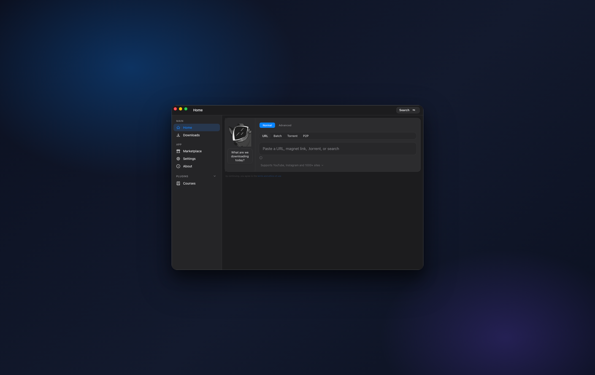
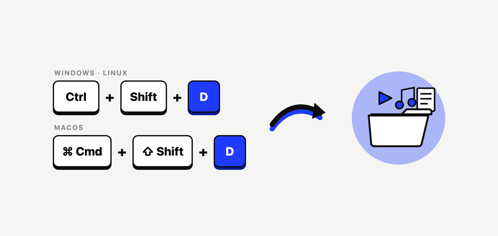
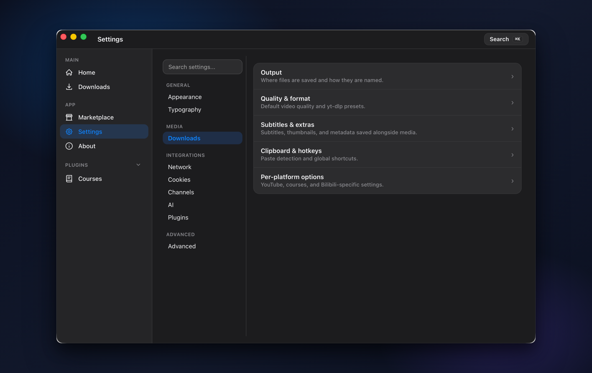
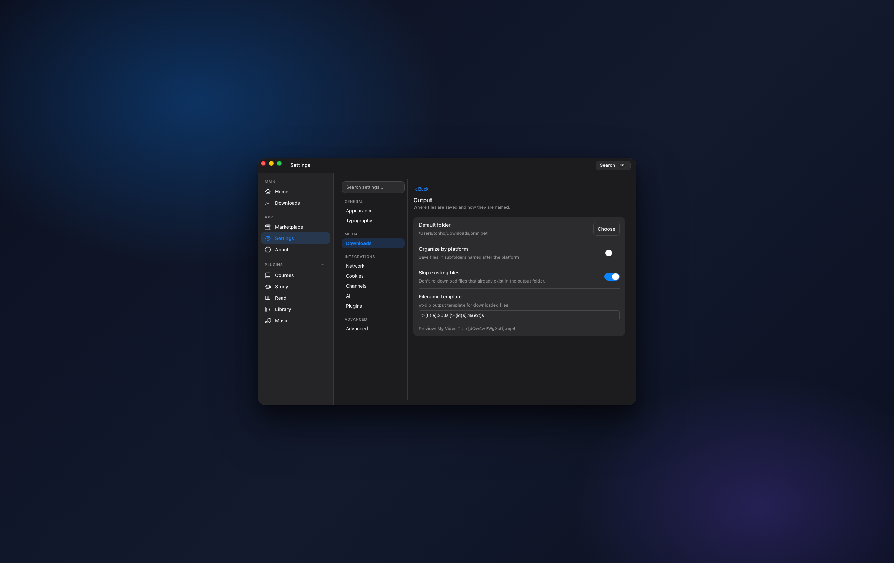
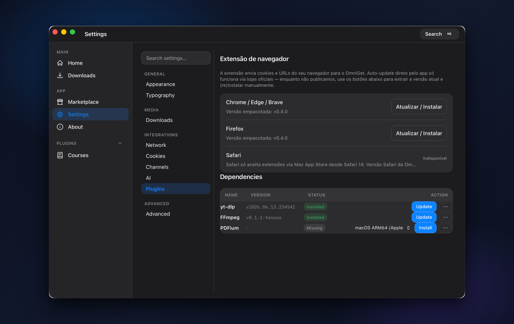

<!--
SEO / discovery: OmniGet - бесплатный загрузчик с открытым исходным кодом для Windows, macOS и Linux.
Рекомендуемые GitHub topics (задайте их в репозитории: Settings > Topics):
downloader, download-manager, media-downloader, video-downloader, youtube-downloader,
yt-dlp, yt-dlp-gui, course-downloader, udemy-downloader, hotmart-downloader,
bilibili-downloader, tiktok-downloader, instagram-downloader, twitter-downloader,
reddit-downloader, telegram-downloader, twitch-downloader, subtitle-downloader,
epub-reader, spaced-repetition
-->

<p align="center">
  
</p>

<h1 align="center">OmniGet</h1>

<h3 align="center">Скачивайте курсы Udemy, YouTube, музыку, книги и 1800+ сайтов в одном приложении. Без терминала.</h3>

<p align="center">
  <a href="README.md">English</a>
  | <a href="README_zh_CN.md">中文</a>
  | <b>Русский</b>
</p>

<p align="center">
  <a href="https://github.com/tonhowtf/omniget/releases/latest"></a>
  <a href="LICENSE"></a>
  <a href="https://github.com/tonhowtf/omniget/stargazers"></a>
  <a href="https://github.com/tonhowtf/omniget/releases"></a>
  <a href="https://hosted.weblate.org/engage/omniget/"></a>
</p>

<p align="center">
  <b>OmniGet — это бесплатное настольное приложение с открытым исходным кодом для Windows, macOS и Linux.</b> Оно скачивает онлайн-курсы (Udemy, Hotmart, Kiwify, Skool, Teachable и другие), видео и аудио с YouTube, TikTok, Instagram, Twitter/X, Reddit и 1800+ других сайтов, а также вашу музыку и книги. Всё воспроизводится прямо в приложении. Без командной строки, без Python, без настройки, и ваши файлы остаются на вашем компьютере. Распространяется по лицензии GPL-3.0.
</p>

<p align="center">
  <a href="#загрузка-и-установка"><b>Скачать для Windows, macOS или Linux</b></a>
  &nbsp;·&nbsp;
  <a href="#одно-нажатие-и-загрузка-пошла"><b>Глобальная горячая клавиша</b></a>
</p>

<p align="center">
  
</p>

---

## Загрузка и установка

Выберите свою систему, скачайте последний релиз и откройте его. Никакого мастера установки и прав администратора не требуется.

<table>
  <tr>
    <th>Платформа</th>
    <th>Как установить</th>
  </tr>
  <tr>
    <td><strong>Windows</strong></td>
    <td>
      <a href="https://github.com/tonhowtf/omniget/releases/latest"></a>
      <br/>
      <sub>Скачайте <code>.exe</code> из Releases и дважды кликните. Это портативная версия, она запускается откуда угодно. Есть также установщик <code>.msi</code>, а если привычнее командная строка — <code>winget install -e --id tonhowtf.OmniGet</code>.</sub>
    </td>
  </tr>
  <tr>
    <td><strong>macOS</strong></td>
    <td>
      <a href="https://github.com/tonhowtf/omniget/releases/latest"></a>
      <br/>
      <sub>Откройте <code>.dmg</code> и перетащите OmniGet в папку «Программы». Сначала прочитайте заметку о первом запуске ниже.</sub>
    </td>
  </tr>
  <tr>
    <td><strong>Linux</strong></td>
    <td>
      <a href="https://github.com/tonhowtf/omniget/releases/latest"></a>
      <br/>
      <sub>Debian и Ubuntu — <code>.deb</code>, Fedora и openSUSE — <code>.rpm</code>, остальные дистрибутивы — <code>.AppImage</code>. Собираются сборки для x86_64 и ARM64.</sub>
    </td>
  </tr>
</table>

<sub><strong>AppImage на Debian 12+ и Ubuntu 24.04+:</strong> в этих выпусках больше нет FUSE 2, который нужен AppImage. Если <code>./omniget.AppImage</code> завершается с ошибкой libfuse, выполните <code>sudo apt install libfuse2</code> или запустите с ключом <code>./omniget.AppImage --appimage-extract-and-run</code>. С <code>.deb</code> этой проблемы нет вовсе.</sub>

### ⚠️ Обязательно прочитайте перед первым запуском

OmniGet имеет открытый исходный код и не подписан платным сертификатом, поэтому при первом открытии система может выдать предупреждение. Это ожидаемо, а шаги ниже убирают его навсегда. В любом случае ваши файлы остаются локально.

**macOS (это самое важное, в первый раз приложение не откроется).** Gatekeeper в macOS блокирует неподписанные приложения. После того как вы переместите OmniGet в «Программы», откройте Терминал и выполните эти две строки:

```bash
xattr -cr /Applications/omniget.app
codesign --force --deep --sign - /Applications/omniget.app
```

Затем откройте OmniGet как обычно. Это делается один раз.

**Windows.** При первом запуске SmartScreen может показать синее предупреждение. Нажмите **More info (Подробнее)**, затем **Run anyway (Выполнить в любом случае)**. Это стандартно для приложений с открытым исходным кодом без платного сертификата подписи кода.

### Портативный режим: флешка или рабочий компьютер с ограничениями

Создайте рядом с `.exe` пустой файл с именем `portable.txt` (или `.portable`) и перезапустите приложение. После этого OmniGet держит настройки, базу данных, cookie, плагины, кеш и встроенные yt-dlp и FFmpeg в папке `data` рядом с исполняемым файлом. Ничего не пишется в `AppData\Roaming` или другие пользовательские каталоги, поэтому вся установка переносится вместе с флешкой. Без этого файла OmniGet использует стандартный пользовательский каталог данных.

Бесплатно и с открытым исходным кодом под лицензией GPL-3.0. Обновления идут тихо в фоне. Встроенные инструменты (yt-dlp и FFmpeg) устанавливаются сами, а yt-dlp проверяется по SHA256 перед запуском. Плагины устанавливаются при первом запуске и обновляются сами, настраивать ничего не нужно.

---

## Одно нажатие, и загрузка пошла

Эту часть любят больше всего. Скопируйте любую ссылку, видео с YouTube, твит, сообщение в Discord, трек, магнет-ссылку, и нажмите глобальную горячую клавишу **`Ctrl+Shift+D`** (**`Cmd+Shift+D`** на macOS). OmniGet прочитает буфер обмена и скачает содержимое в фоне. Вам даже не нужно открывать окно.

<p align="center">
  
</p>

Это работает откуда угодно в системе. Неважно, что у вас открыто: браузер, чат, читалка. Скопировал, нажал, готово. Файл попадает в вашу папку, а об остальном заботится очередь. Если вам нужен предпросмотр, просто вставьте ссылку в поле на главном экране, взгляните на варианты качества и нажмите «Скачать».

---

## Какую проблему это решает

У вас уже открыт yt-dlp в терминале. Вы нашли скрипт для скачивания курсов, который ломается при каждом обновлении сайта. Для музыки у вас отдельное приложение, и все они не связаны друг с другом. Каждая загрузка превращается в три инструмента и копипаст.

OmniGet делает всё это в одном окне. Вставьте ссылку на курс, на YouTube, на TikTok, магнет, подкаст, и оно само разберётся. Файл попадает в вашу папку и воспроизводится прямо в приложении.

Это единственное приложение с открытым исходным кодом, которое скачивает полный курс Udemy или Hotmart, видео и аудио с 1800+ сайтов и вашу музыкальную библиотеку в одном месте без командной строки. Оно набрало тысячи звёзд на GitHub за первые месяцы, потому что такого сочетания больше нигде не было.

---

## Чем OmniGet отличается от yt-dlp и других загрузчиков

У разных инструментов разные задачи. Здесь о том, где место OmniGet, а не о том, кто лучше.

### OmniGet и yt-dlp

[yt-dlp](https://github.com/yt-dlp/yt-dlp) — это движок извлечения, и OmniGet работает на нём. yt-dlp — инструмент командной строки: нужно поставить Python, разобраться с ключами, написать выражение выбора формата, и взамен вы получаете непревзойдённый контроль над 1800+ сайтами. Он отлично с этим справляется, и без него OmniGet бы не было.

OmniGet — это приложение вокруг него. Вы скачиваете один файл, вставляете ссылку и видите превью с вариантами качества. yt-dlp и FFmpeg ставятся и обновляются сами, а yt-dlp перед запуском проверяется по SHA256. Сверху — очередь загрузок с повторными попытками и докачкой, история, плеер курсов, читалка и музыкальная библиотека. Если вам привычен терминал и нужны только файлы, берите yt-dlp напрямую. Если нужна библиотека, которую можно смотреть и читать, берите OmniGet.

### OmniGet и загрузчики под одну платформу

Большинство загрузчиков хорошо делают один сайт. OmniGet собирает курсы, видео, аудио, изображения, торренты и Telegram в одну очередь, а потом воспроизводит результат. Компромисс честный: узкоспециализированный инструмент иногда раньше поддержит редкий случай.

### OmniGet и платные загрузчики курсов

Платные загрузчики курсов обычно берут подписку за то, к чему у вас уже есть доступ. OmniGet распространяется по GPL-3.0, без аккаунта, без рекламы и без платных тарифов, и скачивает только то, что уже открывается в вашей собственной авторизованной сессии.

---

## Что скачивает OmniGet

Вставьте ссылку. OmniGet определит сайт, покажет предпросмотр с вариантами качества и скачает. Если сайт поддерживается [yt-dlp](https://github.com/yt-dlp/yt-dlp), OmniGet качает с него, а это примерно на тысячу сайтов больше, чем в таблице ниже.

| Категория | Платформы |
|----------|-----------|
| Онлайн-курсы | Hotmart, Udemy, Kiwify, Gumroad, Teachable, Kajabi, Skool, Wondrium, Thinkific, Rocketseat |
| Видео и аудио | YouTube, Instagram, TikTok, Twitter/X, Reddit, Twitch, Pinterest, Vimeo, Bluesky, Bilibili |
| Bilibili (глубоко) | Войдите для 4K, HDR, Dolby Vision, Hi-Res lossless, Dolby Atmos. Данмаку (XML/ASS/JSON), NFO для Kodi и Jellyfin, 11 типов ссылок (UGC, 番剧, 课程, 收藏夹, UP主, 每周必看, 稍后再看, 历史记录, b23.tv) |
| Азиатские платформы | Douyin (抖音), Xiaohongshu (小红书), Kuaishou (快手), Youku (优酷), iQiyi (爱奇艺), Tencent Video, Mango TV |
| Галереи изображений | DeviantArt, Pixiv, ArtStation, Flickr, Tumblr, альбомы Imgur, Kemono, Newgrounds, имиджборды |
| Массовые профили | Целые сабреддиты и их страницы сортировки, профили пользователей Reddit, профили X/Twitter |
| Файлы и передача | `.torrent` и магнет-ссылки, а также прямая P2P-передача между двумя компьютерами по короткому коду |

То, что люди ищут, и что OmniGet умеет:

- **Скачать полный онлайн-курс**, каждый урок и приложенный PDF, затем смотреть его внутри приложения и продолжать с места остановки.
- **Скачать видео с YouTube или целый плейлист**, выбрать качество или взять только аудио в MP3, M4A, Opus, FLAC или WAV.
- **Скачать TikTok, Instagram, Twitter/X, Reddit**: посты, reels, истории, карусели и галереи.
- **Пакетная загрузка** списка ссылок из текстового файла, целого сабреддита, профиля пользователя Reddit или профиля X/Twitter.
- **Скачать только часть видео**, задав начало и конец.
- **Скачать субтитры** на любом языке, встроить их или сгенерировать через Whisper, если их нет.
- **Пропускать спонсорские вставки** через SponsorBlock, автоматически встраивать метаданные и обложки.
- **Подписаться на канал** и автоматически скачивать новые загрузки с уведомлением в трее.
- **Скачать Bilibili в максимальном качестве**, войдите один раз и откройте 4K, HDR, Hi-Res lossless аудио и Dolby Atmos.

Загрузки надёжны, а не угадайка. Скорость и оставшееся время берутся прямо из загрузчика, а не подделываются из процентов, поэтому они остаются точными даже когда размер файла неизвестен или это прямой эфир. Зависание показывается как зависание, а не как застывшее «осталось 3 секунды». Очередь возобновляет прерванные загрузки и повторяет попытки с задержкой.

---

## И всё это воспроизводится внутри

Этого как раз не ждут. OmniGet это не только место, куда вы качаете. Это место, где вы смотрите, читаете и слушаете.

### Откройте курс и реально посмотрите его

Скачайте весь курс (Hotmart, Udemy, Kiwify, Skool, Teachable, Kajabi, Wondrium, Thinkific) и смотрите, не выходя из приложения. Продолжайте с той секунды, где остановились. Делайте заметки, которые по клику переносят в нужный момент. Читайте приложенные PDF рядом.

<p align="center">
  
  <br/>
  <em>Плеер курсов, заметки закреплены на таймкодах, вложения в том же окне.</em>
</p>

### Читайте настоящие книги

Бросьте папку с PDF и EPUB. OmniGet вытянет из них обложки, найдёт названия и авторов и откроет каждую во встроенной читалке с выделениями, закладками, режимом фокуса и бумажной темой для глаз. CBZ-комиксы, а также TXT и HTML тоже.

<p align="center">
  
  <br/>
  <em>Читалка с выделениями, панелью заметок и режимом фокуса.</em>
</p>

### Музыка такой, какой вы её помните

Укажите OmniGet на папку с музыкой, и он покажет ваши треки так, как раньше это делал iTunes: альбомы с обложками, исполнители с дискографиями, очередь, которая ведёт себя нормально.

- Играет MP3, FLAC, M4A, OGG, Opus, всё, что у вас уже есть.
- Подтягивает **синхронизированный текст**, который прокручивается вместе с песней.
- Подключается к **Spotify, SoundCloud, YouTube Music, Qobuz и Last.fm**, чтобы плейлисты и лайки были рядом с локальными файлами.
- **Эквалайзер** с пресетами, варианты тёмной темы под обложку альбома, панель активности с топ-треками и статус в Discord с тем, что вы слушаете.

<p align="center">
  
  <br/>
  <em>Локальная библиотека, синхротекст, стриминговые источники, один плеер.</em>
</p>

---

## Настройки, которые не мешают

Настройки сгруппированы и не шумят. Частые опции прямо перед вами, глубокие живут в одном касании, а поиск находит что угодно по всем категориям и подсвечивает это.

<p align="center">
  
  <br/>
  <em>Сгруппированная боковая панель, один понятный список, каждый раздел открывает свою страницу.</em>
</p>

<p align="center">
  
  <br/>
  <em>Вывод, качество, субтитры и остальное, с короткой подсказкой под каждым пунктом.</em>
</p>

---

## Для игроков в League of Legends, если вам это нужно

В OmniGet встроено меню League of Legends. Оно поставляется **выключенным**. Ничего не подключается, ничего не отслеживается, и меню даже не появляется в боковой панели, пока вы не включите его в **Настройки → Дополнительно → League of Legends**. Оставьте его выключенным — и OmniGet работает ровно так же, как раньше.

Включите — и он читает запущенный клиент League так же, как клиент читает сам себя: без аккаунта, без входа и без сторонних сайтов со сборками.

- **Разведка матча** по обеим командам. Ранг, текущая форма, KDA, чемпионы, на которых человек реально играет, и короткие пометки, которые приложение выводит само: серия побед, уан-трик, низкий винрейт. Оставьте свою заметку об игроке — она вернётся при следующей встрече.
- **Вероятность победы** с честной статистикой. Винрейты сжимаются к базовому уровню по размеру выборки, поэтому пятьдесят процентов за тысячу игр и пятьдесят за десять — это не одно и то же свидетельство, а результат всегда идёт с диапазоном, а не с выдуманной десятой долей. Подбор игроков стремится к равным матчам, поэтому честный ответ обычно близок к равенству — и приложение говорит об этом прямо.
- **Экономика в реальном времени**. Золото, фарм и уровень всех десяти игроков и разрыв с оппонентом на вашей линии.
- **Цели по ролям**, которые можно редактировать. Саппорта не оценивают по фарму, а лесника — как стрелка.
- **Руны и заклинания призывателя**, рекомендованные самим клиентом игры, применяются в один клик. Заменяется только страница, созданную OmniGet, ваши остаются нетронутыми.
- **Тиры чемпионов** по ролям с процентами побед, выборов и банов.
- **Поиск игрока** по любому Riot ID: ранг, статистика по чемпионам и мастерство.
- **Автоматизация**, вся по вашему выбору: принятие матчей, пик и бан по вашему списку приоритетов и подбор чемпиона со скамейки в ARAM.

<p align="center">
  <em>Всё перечисленное выключено по умолчанию, и у каждой автоматизации свой переключатель.</em>
</p>

---

## Плагины, которые устанавливаются сами

OmniGet поставляется с полным набором плагинов (курсы, обучение, Telegram, конвертация и другие), и они настраиваются сами при первом запуске. Они также сами обновляются, когда выходит новая версия, так что вам не нужно ничего искать и качать. Включайте и выключайте любой из них в боковой панели и удаляйте ненужные. Что вы удалили, то и остаётся удалённым.

<p align="center">
  
  <br/>
  <em>Плагины и встроенные инструменты, управляются за вас, показаны понятной таблицей.</em>
</p>

---

## Мелочи, которые в сумме решают

Тихо рядом, когда нужны.

- **Мастерская субтитров**, открывает SRT, VTT и ASS, с инструментами тайминга, синхронизацией по двум точкам, поиском и заменой, автоисправлением в один клик, AI-переводом и AI-исправлением грамматики, и осциллограммой с метками смены кадра.
- **Таймер фокуса Pomodoro**, ставит видео на паузу в конце сессии.
- **Заметки** с двусторонними ссылками, ежедневным дневником и графом знаний.
- **Панель прогресса** со счётчиком серий, дневными целями и тепловой картой по году.
- **Конвертер FFmpeg** для локальных файлов, без интернета.
- **Браузер чатов Telegram**, сохраняет фото, видео и файлы из любого чата.
- **Браузерное расширение** (Chrome и Firefox), передаёт текущую страницу в OmniGet одним кликом.
- **Глобальная горячая клавиша** (`Ctrl+Shift+D`, или `Cmd+Shift+D` на macOS), скачивает любую ссылку из буфера обмена.
- **9 языков** и **14 тем**, включая Catppuccin, Dracula, One Dark Pro и три варианта для электронных чернил.

---

## Частые вопросы

**Нужен ли аккаунт, чтобы пользоваться OmniGet?**
Нет. Собственный аккаунт или регистрация OmniGet не нужны. Входить на платформу приходится только тогда, когда этого требует сам контент — например, купленный вами курс или премиум-поток Bilibili, — и эта сессия остаётся на вашем компьютере.

**Может ли OmniGet скачать плейлист или целый канал YouTube?**
Да. Вставьте ссылку на плейлист, и OmniGet поставит в очередь каждое видео из него. Можно также подписаться на канал, и OmniGet будет автоматически скачивать новые загрузки и показывать уведомление в трее.

**Продолжит ли OmniGet прерванную загрузку?**
Да. Очередь сохраняет частично скачанные файлы и продолжает с того места, где остановилась, а при ограничении скорости со стороны сайта повторяет попытки с нарастающей паузой. Закрытие приложения или обрыв связи не обнуляют прогресс.

**Какие форматы файлов сохраняет OmniGet?**
Видео — MP4, MKV или WebM, аудио — MP3, M4A, Opus, FLAC или WAV. Субтитры сохраняются как SRT, VTT или ASS и могут встраиваться в видеофайл. Книги открываются в форматах PDF, EPUB, CBZ, TXT и HTML.

**Может ли OmniGet скачать платный контент, который я уже купил?**
OmniGet скачивает то, что уже открывается в вашей собственной авторизованной сессии, например купленный курс Udemy или Hotmart. Он не обходит DRM, не взламывает платный доступ и не передаёт чужие учётные данные. То, к чему у вас нет доступа, останется недоступным.

**OmniGet бесплатный?**
Да. Бесплатно и с открытым исходным кодом под GPL-3.0, без аккаунта, без рекламы и без платных тарифов.

**Нужен ли терминал или Python?**
Нет. OmniGet это обычное настольное приложение. Скачайте, откройте, вставьте ссылку. yt-dlp и FFmpeg встроены и обновляются сами. Единственный раз, когда может понадобиться Терминал, это одноразовый шаг первого запуска на macOS выше.

**Приложение не открывается на macOS, что делать?**
Выполните две команды в Терминале из заметки о первом запуске выше. Gatekeeper блокирует неподписанные приложения с открытым кодом, а эти строки снимают флаг. Делается один раз.

**Это просто графическая оболочка для yt-dlp?**
Для тех 1800+ обычных сайтов он использует yt-dlp под капотом, плюс нативные экстракторы для крупных платформ, а сверху настоящий интерфейс, очередь, библиотека и встроенные плееры. Так что да, и намного больше, чем оболочка.

**Может ли он скачать полный курс Udemy или Hotmart?**
Да. Вы один раз входите на платформе, выбираете курс, и OmniGet скачивает каждый урок и вложение, а затем воспроизводит их с заметками по таймкодам.

**Какие сайты поддерживаются?**
Онлайн-курсы, YouTube, TikTok, Instagram, Twitter/X, Reddit, Twitch, Vimeo, Bilibili, Pinterest, Bluesky, крупные азиатские платформы, галереи изображений, торренты и магнеты, плюс около 1800 других через yt-dlp.

**Работает ли на Windows, macOS и Linux?**
Да, на всех трёх, в сборках для x86_64 и ARM64. Для Windows есть портативный `.exe`, установщик `.msi` и пакет winget. Для macOS — `.dmg` для Apple Silicon и Intel. Для Linux — `.deb`, `.rpm` и `.AppImage`.

**Какие дистрибутивы Linux поддерживаются?**
OmniGet работает на любом современном настольном Linux. Для Debian и Ubuntu лучше взять `.deb`, для Fedora и openSUSE — `.rpm`, для остальных — `.AppImage`. На Debian 12+ и Ubuntu 24.04+ для AppImage сначала нужно выполнить `sudo apt install libfuse2`, потому что в этих выпусках убрали FUSE 2; для `.deb` это не требуется.

**Можно скачать только аудио или только фрагмент?**
Да. Извлеките аудио в MP3, M4A, Opus, FLAC или WAV, или задайте начало и конец, чтобы скачать только нужную часть.

**Мои загрузки приватны?**
Да. Всё работает локально, и ваши файлы не покидают компьютер. Никакой телеметрии о том, что вы скачиваете.

**Можно ли скачать Bilibili в 4K, HDR или Hi-Res lossless?**
Да, при входе в аккаунт Bilibili. OmniGet работает с официальным API Bilibili и точно соблюдает то, что открывает ваша премиум-подписка 大会员. Без входа загрузки всё равно работают через yt-dlp в стандартном качестве.

---

## Сборка из исходников

Для разработчиков. Если вы просто хотите пользоваться OmniGet, [возьмите релиз](#загрузка-и-установка).

```bash
git clone https://github.com/tonhowtf/omniget.git
cd omniget
pnpm install
pnpm tauri dev
```

Требуются [Rust](https://rustup.rs/), [Node.js](https://nodejs.org/) 18+ и [pnpm](https://pnpm.io/).

<details>
<summary>Зависимости сборки для Linux</summary>

```bash
sudo apt-get install -y libwebkit2gtk-4.1-dev build-essential curl wget file libxdo-dev libssl-dev libayatana-appindicator3-dev librsvg2-dev patchelf
```

</details>

Продакшен-сборка: `pnpm tauri build`.

### Интерфейс командной строки (собирается вручную)

В репозитории также есть `omniget-cli` — небольшая программа на Rust, которая делает OmniGet пригодным для скриптов. **В готовые сборки она пока не входит**, её нужно собрать из этого репозитория:

```bash
cargo build --release -p omniget-cli
```

```bash
omniget info <url>                     # только превью: название, форматы, размер
omniget download <url> -q 1080 -o ~/Videos
omniget download <url> --audio-only --subs ru,en
omniget batch links.txt -m 3           # по одной ссылке в строке, по 3 одновременно
omniget import-cookies cookies.txt     # формат Netscape
```

Настольному приложению это не нужно совсем. Оно существует для cron, dotfiles и скриптов.

---

## Участие

Нашли баг или есть идея? [Откройте issue](https://github.com/tonhowtf/omniget/issues). Pull request приветствуются, см. [CONTRIBUTING.md](CONTRIBUTING.md).

OmniGet переводится на [Weblate](https://hosted.weblate.org/engage/omniget/). Выберите язык, переводите в браузере, и Weblate сам откроет pull request.

## Уведомление для владельцев платформ

Если вы представляете указанную платформу и у вас есть вопросы, напишите на **tonhowtf@gmail.com** с корпоративного адреса. Платформа будет убрана из списка сразу же.

## Правовая информация

OmniGet предназначен для личного использования. Уважайте авторские права и условия каждой платформы. Вы отвечаете за то, что скачиваете.

## Лицензия

[GPL-3.0](LICENSE). Название OmniGet, логотип и талисман Loop являются товарными знаками проекта и не покрываются лицензией на код.
