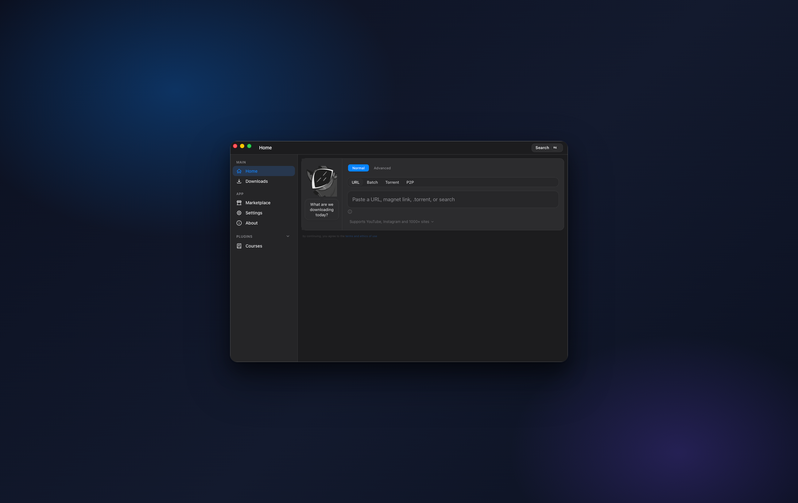
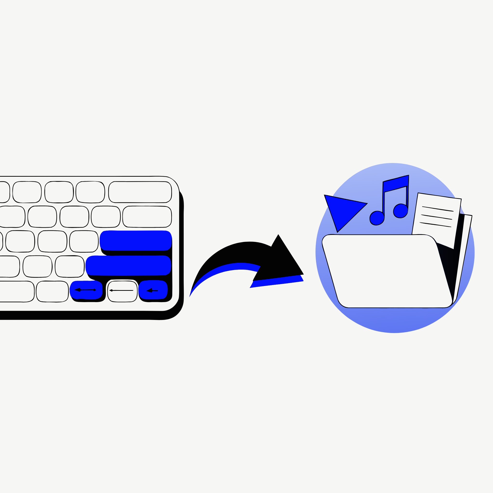
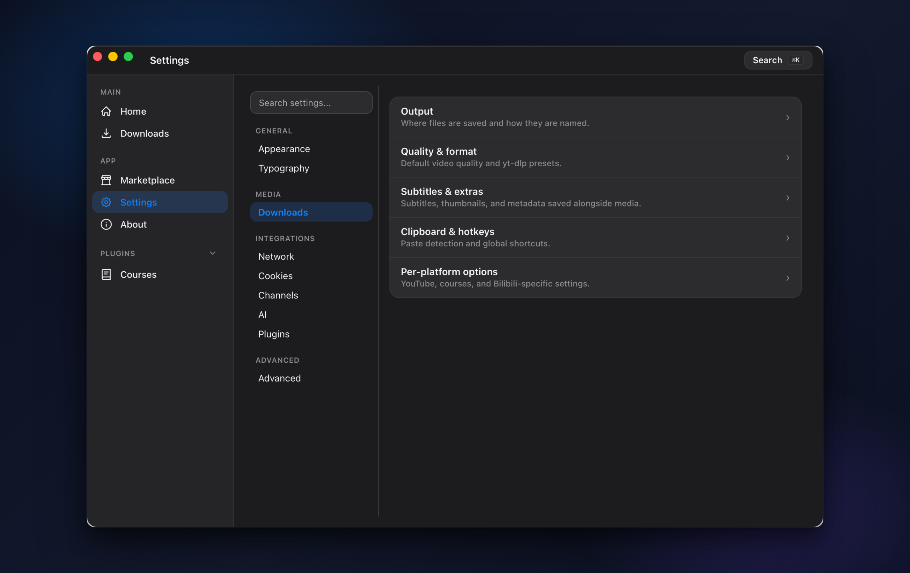
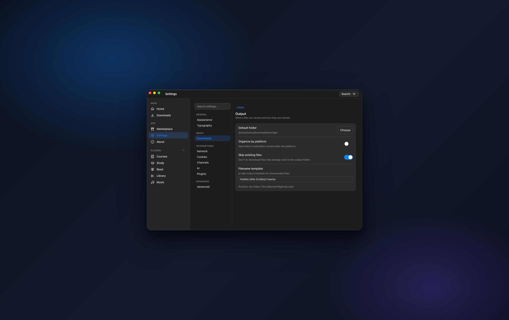
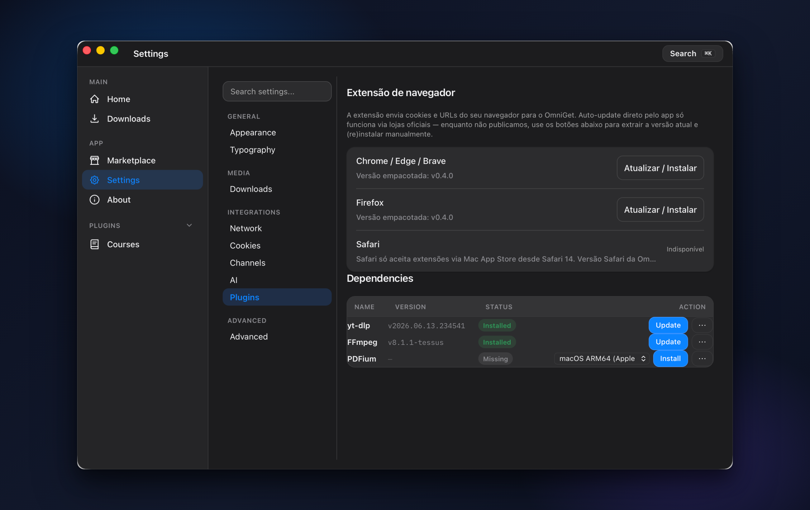

<!--
SEO / discovery: OmniGet 是适用于 Windows、macOS 和 Linux 的免费开源下载器。
建议的 GitHub topics（在仓库 Settings > Topics 中设置）:
video-downloader, youtube-downloader, media-downloader, course-downloader, udemy-downloader,
music-downloader, ebook-reader, yt-dlp, yt-dlp-gui, tauri, svelte, rust, desktop-app,
cross-platform, open-source, instagram-downloader, tiktok-downloader, bilibili, torrent, p2p
-->

<p align="center">
  
</p>

<h1 align="center">OmniGet</h1>

<h3 align="center">一个应用，下载 Udemy 课程、YouTube、音乐、电子书，以及 1,800+ 网站。无需终端。</h3>

<p align="center">
  <a href="README.md">English</a>
  | <b>中文</b>
  | <a href="README.ru.md">Русский</a>
</p>

<p align="center">
  <a href="https://github.com/tonhowtf/omniget/releases/latest"></a>
  <a href="LICENSE"></a>
  <a href="https://github.com/tonhowtf/omniget/stargazers"></a>
  <a href="https://github.com/tonhowtf/omniget/releases"></a>
  <a href="https://hosted.weblate.org/engage/omniget/"></a>
</p>

<p align="center">
  <b>OmniGet</b> 是一款适用于 Windows、macOS 和 Linux 的免费开源桌面应用。它可以下载在线课程（Udemy、Hotmart、Kiwify、Skool、Teachable 等），下载来自 YouTube、TikTok、Instagram、Twitter/X、Reddit 以及 1,800+ 其他网站的视频和音频，还能管理你的音乐和电子书。所有内容都能在应用内播放。无需命令行，无需 Python，无需配置，你的文件始终留在本地电脑上。
</p>

<p align="center">
  <a href="#下载与安装"><b>下载 Windows、macOS 或 Linux 版本</b></a>
  &nbsp;·&nbsp;
  <a href="#一个快捷键就开始下载"><b>了解一键下载快捷键</b></a>
</p>

<p align="center">
  
</p>

---

## 下载与安装

选择你的系统，下载最新版本，然后打开它。没有冗长的安装向导，也不需要管理员权限。

<table>
  <tr>
    <th>平台</th>
    <th>如何安装</th>
  </tr>
  <tr>
    <td><strong>Windows</strong></td>
    <td>
      <a href="https://github.com/tonhowtf/omniget/releases/latest"></a>
      <br/>
      <sub>从 Releases 下载 <code>.exe</code> 并双击运行。它是便携版，放在哪里都能运行。</sub>
    </td>
  </tr>
  <tr>
    <td><strong>macOS</strong></td>
    <td>
      <a href="https://github.com/tonhowtf/omniget/releases/latest"></a>
      <br/>
      <sub>打开 <code>.dmg</code>，把 OmniGet 拖进“应用程序”文件夹。请先阅读下面的首次启动说明。</sub>
    </td>
  </tr>
  <tr>
    <td><strong>Linux</strong></td>
    <td>
      <a href="https://github.com/tonhowtf/omniget/releases/latest"></a>
      <br/>
      <sub>运行 <code>flatpak install wtf.tonho.omniget</code>，或从 Releases 下载安装包。</sub>
    </td>
  </tr>
</table>

### ⚠️ 首次启动前请务必阅读

OmniGet 是开源软件，没有使用付费证书签名，因此第一次打开时系统可能会发出警告。这是正常现象，按下面的步骤操作即可一劳永逸地解决。无论如何，你的文件都只保存在本地。

**macOS（这一步最关键，应用第一次会打不开）。** macOS 的 Gatekeeper 会拦截未签名的应用。把 OmniGet 移到“应用程序”后，打开“终端”并运行这两行命令：

```bash
xattr -cr /Applications/omniget.app
codesign --force --deep --sign - /Applications/omniget.app
```

然后正常打开 OmniGet 即可。只需操作一次。

**Windows。** 首次运行时 SmartScreen 可能会显示蓝色警告。点击 **More info（更多信息）**，然后点击 **Run anyway（仍要运行）**。对于没有付费代码签名证书的开源应用，这是很常见的。

本软件基于 GPL-3.0 免费开源。更新会在后台静默进行。内置工具（yt-dlp 和 FFmpeg）会自行安装，yt-dlp 在运行前会通过 SHA256 校验。插件会在首次启动时安装并自动更新，无需你做任何配置。

---

## 一个快捷键，就开始下载

这是最让人着迷的部分。复制任意链接，无论是 YouTube 视频、一条推文、一条 Discord 消息、一首歌还是一个磁力链接，然后按下全局快捷键 **`Ctrl+Shift+D`**（macOS 上为 **`Cmd+Shift+D`**）。OmniGet 会读取你的剪贴板并在后台下载，你甚至不需要打开窗口。

<p align="center">
  
</p>

它在系统的任何地方都能用。无论你正在浏览、聊天还是阅读，当前是哪个应用都没关系。复制、按键、完成。文件会落到你的文件夹里，剩下的交给下载队列。如果你想先看预览，把链接粘贴到主界面的输入框，看一眼画质选项，再点下载即可。

---

## 它解决的问题

你的终端里已经开着 yt-dlp。你找到的课程下载脚本每次网站更新就失效。你的音乐还要用另一个软件，而它们彼此互不相通。每次下载都变成了三个工具加上反复复制粘贴。

OmniGet 在一个窗口里搞定这一切。粘贴课程链接、YouTube 链接、TikTok、磁力链接、播客，它会自动判断该怎么做。文件落到你的文件夹，并且就在应用里播放。

它是唯一一款能在同一处、无需命令行就完整下载 Udemy 或 Hotmart 课程、下载来自 1,800+ 网站的视频和音频、还能管理音乐库的开源应用。它在上线头几个月就收获了数千个 GitHub star，正是因为这种组合此前别处没有。

---

## OmniGet 能下载什么

粘贴链接。OmniGet 会识别网站，显示带画质选项的预览，然后下载。只要 [yt-dlp](https://github.com/yt-dlp/yt-dlp) 支持某个网站，OmniGet 就能从它下载，这比下面表格多出大约一千个站点。

| 类别 | 平台 |
|----------|-----------|
| 在线课程 | Hotmart、Udemy、Kiwify、Gumroad、Teachable、Kajabi、Skool、Wondrium、Thinkific、Rocketseat |
| 视频和音频 | YouTube、Instagram、TikTok、Twitter/X、Reddit、Twitch、Pinterest、Vimeo、Bluesky、哔哩哔哩 |
| 哔哩哔哩（深度支持） | 登录后可下 4K、HDR、杜比视界、Hi-Res 无损、杜比全景声。弹幕（XML/ASS/JSON）、用于 Kodi 和 Jellyfin 的 NFO、11 种链接类型（UGC、番剧、课程、收藏夹、UP主、每周必看、稍后再看、历史记录、b23.tv） |
| 亚洲平台 | 抖音、小红书、快手、优酷、爱奇艺、腾讯视频、芒果 TV |
| 图集 | DeviantArt、Pixiv、ArtStation、Flickr、Tumblr、Imgur 相册、Kemono、Newgrounds、各类图床 |
| 文件与传输 | `.torrent` 和磁力链接，以及两台电脑之间用短代码直接 P2P 传输 |

大家常搜、OmniGet 都能做到的：

- **下载完整的在线课程**，包括每节课和附带的 PDF，然后在应用内观看，并从上次停下的地方继续。
- **下载 YouTube 视频或整个播放列表**，自选画质，或只提取音频，格式可选 MP3、M4A、Opus、FLAC 或 WAV。
- **下载 TikTok、Instagram、Twitter/X、Reddit** 的帖子、短视频、快拍、轮播图和图集。
- **批量下载** 文本文件里的链接列表，或某个创作者的整个主页。
- **只下载视频的一部分**，设置开始和结束时间即可。
- **下载任意语言的字幕**，可嵌入，也可在没有字幕时用 Whisper 自动生成。
- **跳过赞助片段**（SponsorBlock），并自动嵌入元数据和缩略图。
- **关注频道**，自动下载新发布的内容，并通过托盘通知提醒。
- **以最高画质下载哔哩哔哩**，登录一次即可解锁 4K、HDR、Hi-Res 无损音频和杜比全景声。

下载是可靠的，而不是靠猜。速度和剩余时间直接来自下载器，而不是用百分比伪造出来的，所以即使文件大小未知或是直播流，它们也保持准确。卡住时会明确显示为卡住，而不是停在“还剩 3 秒”。队列会续传中断的下载，并按退避策略重试。

---

## 它还能在应用内播放一切

这是大家没想到的部分。OmniGet 不只是下载的地方，也是你观看、阅读和聆听的地方。

### 打开课程，真正地学起来

下载整门课程（Hotmart、Udemy、Kiwify、Skool、Teachable、Kajabi、Wondrium、Thinkific），无需离开应用即可观看。从你停下的那一秒继续。记笔记，点击就能跳回那个时刻。并排阅读附带的 PDF。

<p align="center">
  
  <br/>
  <em>课程播放器，笔记钉在时间戳上，附件在同一个窗口里。</em>
</p>

### 阅读真正的书

放入一个装着 PDF 和 EPUB 的文件夹。OmniGet 会从中提取封面，获取书名和作者，并在内置阅读器中打开，支持高亮、书签、专注模式，以及护眼的纸张质感主题。CBZ 漫画以及 TXT、HTML 也支持。

<p align="center">
  
  <br/>
  <em>阅读器，带高亮、笔记面板和专注模式。</em>
</p>

### 音乐，还是你记忆中的样子

把 OmniGet 指向你的音乐文件夹，它会像当年的 iTunes 那样展示你的曲目：带封面的专辑、带作品集的歌手，还有一个听话的播放队列。

- 播放 MP3、FLAC、M4A、OGG、Opus，凡是你已有的格式都能放。
- 拉取 **同步歌词**，让歌词随歌曲滚动。
- 连接 **Spotify、SoundCloud、YouTube Music、Qobuz 和 Last.fm**，让你的歌单和喜欢的歌曲与本地文件并排出现。
- **均衡器** 带预设、按专辑封面变化的深色主题、显示热门曲目的活动面板，还有显示你正在听什么的 Discord 状态。

<p align="center">
  
  <br/>
  <em>本地音乐库、同步歌词、流媒体来源，一个播放器全搞定。</em>
</p>

---

## 不打扰你的设置

设置是分组的，安静而清爽。常用选项就在眼前，深度选项只在一步之遥，搜索框能跨所有分类找到任意设置并为你高亮。

<p align="center">
  
  <br/>
  <em>分组侧边栏，一份清晰的列表，每个分区都打开自己的页面。</em>
</p>

<p align="center">
  
  <br/>
  <em>输出、画质、字幕等等，每个选项下面都有一行简短说明。</em>
</p>

---

## 会自我安装的插件

OmniGet 自带完整的插件（课程、学习、Telegram、转换等等），它们会在首次启动时自行安装。当有新版本发布时，它们也会自动更新，你永远不用去手动找下载。可以在侧边栏里随时开关任意插件，也可以卸载你不需要的。你移除的，就一直保持移除状态。

<p align="center">
  
  <br/>
  <em>插件和内置工具，已为你管理好，并以清晰的表格展示。</em>
</p>

---

## 那些加起来很顶用的小功能

需要时静静地待在那里。

- **字幕工作室**，可打开 SRT、VTT 和 ASS，带时间轴工具、两点同步、查找替换、一键自动修复、AI 翻译和 AI 语法修复，以及带镜头切换标记的波形图。
- **番茄专注计时器**，会在专注结束时暂停你的视频。
- **笔记应用**，带双向链接、每日日记和知识图谱。
- **进度面板**，带连续打卡计数、每日目标和年度风格的热力图。
- **FFmpeg 转换器**，处理本地文件，无需联网。
- **Telegram 聊天浏览器**，可保存任意聊天中的照片、视频和文件。
- **浏览器扩展**（Chrome 和 Firefox），一键把当前页面交给 OmniGet。
- **全局快捷键**（`Ctrl+Shift+D`，macOS 上为 `Cmd+Shift+D`），下载剪贴板里的任意链接。
- **9 种语言** 和 **14 种主题**，包括 Catppuccin、Dracula、One Dark Pro 以及三种墨水屏配色。

---

## 常见问题

**OmniGet 免费吗？**
免费。基于 GPL-3.0 开源，无需账号，没有广告，也没有付费档位。

**我需要终端或 Python 吗？**
不需要。OmniGet 是一个普通的桌面应用。下载、打开、粘贴链接即可。yt-dlp 和 FFmpeg 已内置并会自动更新。唯一可能用到“终端”的，是上面那一次性的 macOS 首次启动步骤。

**在 macOS 上应用打不开，怎么办？**
运行[首次启动说明](#️-首次启动前请务必阅读)里的两条终端命令。Gatekeeper 会拦截未签名的开源应用，那两行命令会清除这个标记。只需操作一次。

**这只是 yt-dlp 的图形界面吗？**
对于那 1,800+ 个通用网站，它底层使用 yt-dlp，同时为大平台配有原生解析器，并在其上提供真正的界面、下载队列、媒体库和内置播放器。所以可以说是，但远不止一个图形界面。

**它能下载完整的 Udemy 或 Hotmart 课程吗？**
可以。你在平台上登录一次，选择课程，OmniGet 就会下载每节课和每个附件，然后用带时间戳笔记的播放器回放。

**支持哪些网站？**
在线课程、YouTube、TikTok、Instagram、Twitter/X、Reddit、Twitch、Vimeo、哔哩哔哩、Pinterest、Bluesky、各大亚洲平台、图集、种子和磁力，以及通过 yt-dlp 支持的约 1,800 个网站。

**它能在 Windows、macOS 和 Linux 上运行吗？**
都可以。Windows 是便携版 `.exe`，macOS 是 `.dmg`，Linux 是 Flatpak 或安装包。

**能只下载音频，或者只下一个片段吗？**
可以。提取音频为 MP3、M4A、Opus、FLAC 或 WAV，或者设置开始和结束时间，只下载你需要的那一段。

**我的下载是私密的吗？**
是的。一切都在本地运行，你的文件不会离开你的电脑。对于你下载了什么，没有任何遥测。

**能以 4K、HDR 或 Hi-Res 无损下载哔哩哔哩吗？**
可以，需要登录哔哩哔哩账号。OmniGet 对接哔哩哔哩官方 API，严格遵循你的大会员订阅所解锁的权限。不登录时，仍可通过 yt-dlp 以标准画质下载。

---

## 从源码构建

面向开发者。如果你只是想使用 OmniGet，请[下载发行版](#下载与安装)。

```bash
git clone https://github.com/tonhowtf/omniget.git
cd omniget
pnpm install
pnpm tauri dev
```

需要 [Rust](https://rustup.rs/)、[Node.js](https://nodejs.org/) 18+ 和 [pnpm](https://pnpm.io/)。

<details>
<summary>Linux 构建依赖</summary>

```bash
sudo apt-get install -y libwebkit2gtk-4.1-dev build-essential curl wget file libxdo-dev libssl-dev libayatana-appindicator3-dev librsvg2-dev patchelf
```

</details>

生产构建：`pnpm tauri build`。

---

## 参与贡献

发现 bug 或有功能建议？[提交 issue](https://github.com/tonhowtf/omniget/issues)。欢迎提交 PR，详见 [CONTRIBUTING.md](CONTRIBUTING.md)。

OmniGet 在 [Weblate](https://hosted.weblate.org/engage/omniget/) 上进行翻译。选择一种语言，在浏览器里翻译，Weblate 会自动开 PR。

## 致平台方

如果你代表某个被列出的平台并有顾虑，请用公司邮箱发邮件至 **tonhowtf@gmail.com**。该平台会立即从列表中移除。

## 法律声明

OmniGet 仅供个人使用。请尊重版权和各平台的服务条款。你需对自己下载的内容负责。

## 许可证

[GPL-3.0](LICENSE)。OmniGet 名称、徽标和吉祥物 Loop 是项目商标，不在代码许可证的涵盖范围内。
